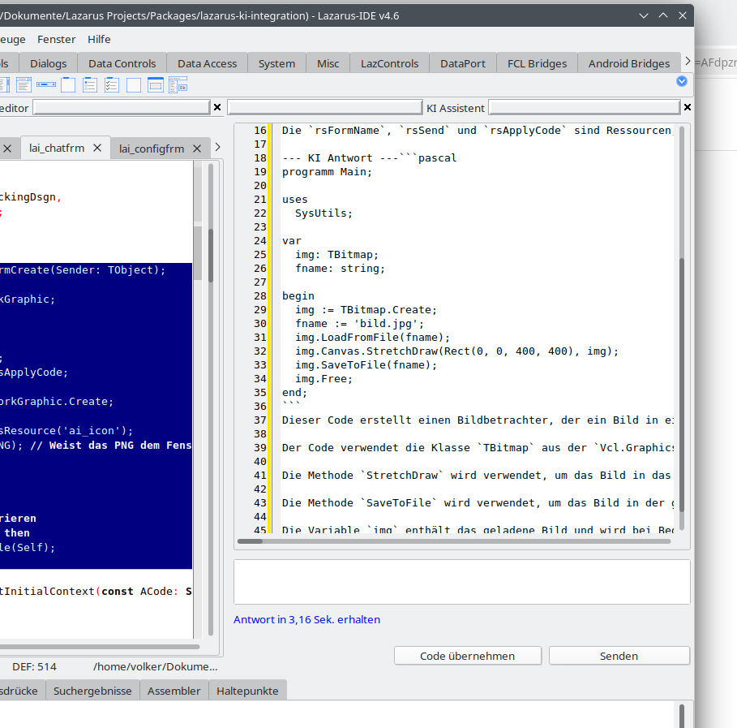

Lazarus AI Assistant
Ein Plugin für die Lazarus IDE (getestet mit v4.6), das eine KI-Unterstützung direkt in die Entwicklungsumgebung integriert – ähnlich wie GitHub Copilot, aber lokal und datenschutzfreundlich.
Features

    Andockbares Chat-Fenster: Integriert sich nahtlos in das Lazarus-Layout.
    Ollama Integration: Nutzt lokale LLMs (z.B. Llama3 oder CodeLlama).
    Code-Extraktion: Erkennt Pascal-Code in der KI-Antwort und erlaubt die Übernahme per Klick.
    Kontext-Support: Markierter Code im Editor kann direkt an den Chat gesendet werden.
    Supported Languages: German (Native), English

Voraussetzungen

    Lazarus 4.x (oder höher).
    Ollama: Muss lokal installiert sein und laufen.
        Download: ollama.com
        Modell ziehen: ollama run CodeLlama (oder dein bevorzugtes Modell).

Installation

    Klone dieses Repository in deinen Lazarus-Komponenten-Ordner.
    Öffne die Datei LazarusAI.lpk in Lazarus über Paket > Paket-Datei (.lpk) öffnen....
    Klicke auf Kompilieren und anschließend auf Nutzung > Installieren.
    Lazarus wird neu kompiliert und startet mit dem neuen Plugin.
    Du findest den Assistenten unter Werkzeuge > KI Chat Fenster öffnen.

Lizenz
MIT License

